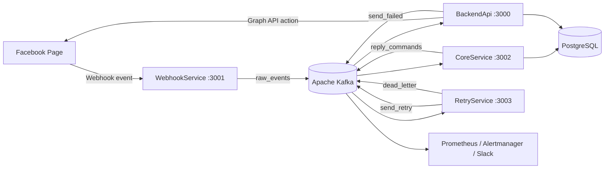

# Facebook Page Realtime Moderation Pipeline

Hệ thống quản lý và tự động hóa tương tác trên Facebook Page theo kiến trúc hướng sự kiện. Project nhận bình luận qua Meta Webhooks, truyền dữ liệu bằng Apache Kafka, phát hiện spam, phân tích cảm xúc bằng Gemini AI và thực thi hành động qua Facebook Graph API.

Project được xây dựng bằng **.NET 8**, **PostgreSQL**, **Apache Kafka** và gồm bốn service độc lập.

## Tính năng chính

- Quản lý Facebook Page, bài viết, bình luận, lượt thích và insights qua REST API.
- Nhận bình luận Facebook theo thời gian thực bằng Meta Webhooks.
- Xác thực webhook bằng `X-Hub-Signature-256` và HMAC-SHA256.
- Chuẩn hóa sự kiện trước khi publish vào Kafka.
- Phát hiện spam chứa liên kết, nội dung lặp và nội dung nguy hiểm.
- Phân tích `intent`, `sentiment` và `confidence` bằng Gemini AI.
- Tự động cảm ơn bình luận tích cực và xin lỗi bình luận tiêu cực.
- Tự động ẩn spam, blacklist người dùng và đưa nội dung nguy hiểm vào review queue.
- Rate limiting, exponential backoff retry, circuit breaker và idempotency.
- Dead Letter Queue, Prometheus, Alertmanager và cảnh báo Slack.

## Kiến trúc hệ thống



### Trách nhiệm của từng service

| Service | Port | Trách nhiệm |
|---|---:|---|
| `WebhookService` | `3001` | Verify webhook, kiểm tra HMAC-SHA256, normalize comment và publish `raw_events` |
| `CoreService` | `3002` | Rate limit, phát hiện spam, gọi Gemini AI, ra quyết định và publish `reply_commands` |
| `BackendApi` | `3000` | Cung cấp REST API, consume action command, kiểm tra idempotency và gọi Facebook Graph API |
| `RetryService` | `3003` | Retry lỗi tạm thời theo exponential backoff và chuyển message hết retry vào `dead_letter` |

### Kafka topics

| Topic | Producer | Consumer | Mục đích |
|---|---|---|---|
| `raw_events` | WebhookService | CoreService | Comment Facebook đã được chuẩn hóa |
| `reply_commands` | CoreService | BackendApi | Lệnh hide, reply hoặc block |
| `send_failed` | BackendApi | RetryService | Command thất bại nhưng có thể thử lại |
| `send_retry` | RetryService | BackendApi | Command được gửi lại sau thời gian chờ |
| `dead_letter` | BackendApi / RetryService | Monitoring / vận hành | Lỗi vĩnh viễn hoặc đã hết số lần retry |

## Cấu trúc project

```text
.
├── BackendApi/          # REST API và worker thực thi Facebook action
├── CoreService/         # Consumer phân tích spam, AI và decision engine
├── WebhookService/      # Endpoint nhận Meta Webhooks
├── RetryService/        # Retry worker và Dead Letter Queue
├── Pipeline.Tests/      # Unit tests cho retry và phân loại lỗi
├── tests/               # Script và SQL hỗ trợ kiểm thử
├── docs/                # Tài liệu và hướng dẫn kiểm thử
├── prometheus/          # Prometheus config và alert rules
├── alertmanager/        # Alertmanager template
└── docker-compose.yml   # Kafka, PostgreSQL và monitoring stack
```

## Yêu cầu môi trường

- [.NET 8 SDK](https://dotnet.microsoft.com/download/dotnet/8.0)
- [Docker Desktop](https://www.docker.com/products/docker-desktop/)
- [ngrok](https://ngrok.com/) hoặc HTTPS tunnel tương đương
- Meta Developer App và Facebook Page dùng để kiểm thử
- Gemini API key
- Slack Incoming Webhook nếu muốn nhận cảnh báo DLQ

## Cấu hình local

Các file `appsettings.Development.json` chứa secret cục bộ và không được commit lên Git.

Tạo cấu hình local từ file mẫu:

```powershell
Copy-Item WebhookService\appsettings.Development.Example.json WebhookService\appsettings.Development.json
Copy-Item CoreService\appsettings.Development.Example.json CoreService\appsettings.Development.json
Copy-Item BackendApi\appsettings.Development.Example.json BackendApi\appsettings.Development.json
Copy-Item RetryService\appsettings.Development.Example.json RetryService\appsettings.Development.json
```

Điền các giá trị cần thiết:

| Service | Cấu hình |
|---|---|
| WebhookService | `Facebook:VerifyToken`, `Facebook:AppSecret`, `Facebook:PageId` |
| CoreService | `Gemini:ApiKey`, `Gemini:Model`, `ConnectionStrings:Postgres` |
| BackendApi | `Facebook:PageAccessToken`, `Facebook:PageId`, `Dashboard:AdminApiKey` |
| RetryService | Kafka topics và `MaxRetryAttempts` |

Để bật cảnh báo Slack:

```powershell
Copy-Item .env.example .env
```

Sau đó thay placeholder trong `.env` bằng Slack Incoming Webhook URL thật. Không commit `.env`, access token, API key hoặc app secret.

## Khởi động hệ thống

### 1. Khởi động hạ tầng

```powershell
docker compose up -d
docker compose ps
```

Docker Compose khởi động:

- Zookeeper và Kafka
- PostgreSQL
- Kafka UI
- Kafka Exporter
- Prometheus
- Alertmanager

Container `kafka-init` tự động tạo đủ năm Kafka topic.

Kiểm tra Kafka:

```powershell
Test-NetConnection localhost -Port 9092
```

Kết quả mong đợi:

```text
TcpTestSucceeded : True
```

### 2. Cập nhật database

```powershell
dotnet ef database update --project CoreService\CoreService.csproj
```

BackendApi tự tạo bảng `CommandExecutions` khi worker khởi động.

### 3. Chạy bốn service

Mở bốn terminal riêng tại thư mục gốc:

```powershell
dotnet run --project WebhookService\WebhookService.csproj --launch-profile webhook-service
dotnet run --project CoreService\CoreService.csproj --launch-profile core-service
dotnet run --project BackendApi\BackendApi.csproj --launch-profile backend-api
dotnet run --project RetryService\RetryService.csproj --launch-profile retry-service
```

### 4. Kiểm tra service

```powershell
Invoke-RestMethod http://localhost:3001/health
Invoke-RestMethod http://localhost:3003/health
```

Swagger:

- BackendApi: `http://localhost:3000/swagger`
- WebhookService: `http://localhost:3001/swagger`
- CoreService: `http://localhost:3002/swagger`

## Cấu hình Meta Webhooks

Public WebhookService bằng ngrok:

```powershell
ngrok http 3001
```

Trong Meta Developer Dashboard:

1. Chọn app và thêm Webhooks cho object `Page`.
2. Callback URL: `https://<ngrok-domain>/webhook`.
3. Verify Token phải trùng với `Facebook:VerifyToken`.
4. Subscribe field `feed`.
5. Subscribe app vào đúng Facebook Page cần kiểm thử.

WebhookService cung cấp:

| Method | Endpoint | Chức năng |
|---|---|---|
| `GET` | `/webhook` | Meta challenge verification |
| `POST` | `/webhook` | Nhận, xác thực, normalize và publish sự kiện |
| `GET` | `/health` | Kiểm tra WebhookService |

## REST API quản lý Facebook Page

BackendApi cung cấp các endpoint:

| Method | Endpoint | Chức năng |
|---|---|---|
| `GET` | `/api/page/{pageId}` | Lấy thông tin Page |
| `GET` | `/api/page/{pageId}/posts` | Lấy danh sách bài viết |
| `POST` | `/api/page/{pageId}/posts` | Tạo bài viết |
| `DELETE` | `/api/page/post/{postId}` | Xóa bài viết |
| `GET` | `/api/page/post/{postId}/comments` | Lấy bình luận |
| `GET` | `/api/page/post/{postId}/likes` | Lấy lượt thích |
| `GET` | `/api/page/{pageId}/insights` | Lấy Page insights |

Khi `Dashboard:AdminApiKey` được cấu hình, mọi endpoint `/api/page` yêu cầu header:

```http
X-Admin-Key: <ADMIN_API_KEY>
```

Ví dụ gọi API mà không hiển thị key trực tiếp trong terminal:

```powershell
$config = Get-Content .\BackendApi\appsettings.Development.json -Raw | ConvertFrom-Json
$pageId = $config.Facebook.PageId
$adminKey = $config.Dashboard.AdminApiKey

Invoke-RestMethod `
  -Uri "http://localhost:3000/api/page/$pageId" `
  -Headers @{ "X-Admin-Key" = $adminKey }
```

## Logic phân tích và tự động hóa

### Spam moderation

| Điều kiện | Quyết định |
|---|---|
| Comment chứa link hoặc nội dung lặp | Ẩn comment |
| Cùng người dùng spam 3 lần trong 24 giờ | Blacklist và ẩn comment |
| Nội dung nguy hiểm hoặc scam | Đưa vào review queue và ẩn comment |
| Người trong blacklist tiếp tục spam | Ẩn ngay; đủ ngưỡng thì phát command block |

### AI sentiment automation

| Kết quả | Hành động |
|---|---|
| `positive` | Trả lời cảm ơn |
| `negative` | Trả lời xin lỗi và đề nghị hỗ trợ |
| `neutral` | Ghi nhận, không tự động phản hồi |
| Spam | Ưu tiên moderation, không phản hồi |

Comment do chính Page tạo ra được bỏ qua để tránh vòng lặp auto-reply.

### Rate limiting

CoreService mặc định giới hạn `20` sự kiện trong `60` giây cho cùng người dùng trên cùng Page. Sự kiện vượt ngưỡng được lưu ở trạng thái `pending_review`, không gọi AI và không thực thi automation ngay.

## Xử lý lỗi và độ tin cậy

### Retry

BackendApi chỉ retry lỗi tạm thời:

- Lỗi mạng và timeout
- HTTP `429`
- HTTP `5xx`

RetryService thử lại theo lịch:

```text
1 giây -> 2 giây -> 4 giây -> dead_letter
```

Các lỗi HTTP `400`, `401`, `403` được coi là lỗi vĩnh viễn và chuyển thẳng vào `dead_letter`.

### Circuit breaker

Facebook Graph API circuit breaker mở sau `10` lỗi liên tiếp và tạm ngừng request trong `60` giây.

### Idempotency

BackendApi lưu `CommandId` trong bảng `CommandExecutions`. Command đã có trạng thái `succeeded` sẽ bị bỏ qua nếu Kafka giao lại:

```text
[IDEMPOTENCY] Duplicate skipped
```

## Database

| Bảng | Mục đích |
|---|---|
| `EventStates` | Theo dõi trạng thái event, AI result, spam và quyết định |
| `BlacklistedUsers` | Theo dõi người dùng spam lặp lại |
| `ReviewQueueItems` | Lưu comment cần quản trị viên kiểm tra |
| `CommandExecutions` | Lưu trạng thái command và bảo đảm idempotency |

Mở PostgreSQL CLI:

```powershell
docker exec -it pageapi123-postgres-1 psql -U postgres -d coreservice_db
```

Xem sự kiện mới nhất:

```sql
SELECT "EventId", "ActorId", "Status", "IsSpam",
       "Intent", "Sentiment", "ActionTaken", "UpdatedAt"
FROM "EventStates"
ORDER BY "UpdatedAt" DESC
LIMIT 20;
```

## Kiểm thử

### Build và unit test

```powershell
dotnet build FacebookPagePipeline.sln
dotnet test FacebookPagePipeline.sln
```

`Pipeline.Tests` kiểm tra:

- Phân biệt lỗi Facebook có thể retry và lỗi vĩnh viễn.
- Exponential backoff `1s`, `2s`, `4s`.
- Dừng retry khi đạt giới hạn.

### Gửi webhook giả lập

```powershell
powershell -ExecutionPolicy Bypass -File .\tests\demo.ps1 `
  -FromId "user-a" `
  -FromName "User A" `
  -Message "Shop oi gia bao nhieu?"
```

Payload giả có `comment_id` không tồn tại trên Facebook, vì vậy action gọi Graph API có thể thất bại. Đây là kết quả mong đợi khi kiểm thử retry và DLQ.

Xem hướng dẫn kiểm thử đầy đủ tại [docs/TEST_GUIDE.md](docs/TEST_GUIDE.md).

## Monitoring

| Công cụ | URL |
|---|---|
| Kafka UI | `http://localhost:8080` |
| Kafka Exporter | `http://localhost:9308/metrics` |
| Prometheus Targets | `http://localhost:9090/targets` |
| Prometheus Alerts | `http://localhost:9090/alerts` |
| Alertmanager | `http://localhost:9093` |

Khi message vào `dead_letter`, Prometheus rule `DeadLetterQueueReceived` sẽ kích hoạt và Alertmanager gửi cảnh báo Slack nếu webhook đã được cấu hình.

## Log cần quan sát

| Terminal | Log chính |
|---|---|
| WebhookService | Nhận webhook, normalize và publish `raw_events` |
| CoreService | `[EVENT]`, `[SPAM]`, `[AI]`, `[DECISION]`, `[COMMAND]` |
| BackendApi | `[BACKEND]`, `[IDEMPOTENCY]`, `[RETRY]`, `[DLQ]` |
| RetryService | `[RETRY]`, `[DLQ]` |

## Sự cố thường gặp

### Kafka broker không kết nối được

```text
1/1 brokers are down
Connect to localhost:9092 failed
```

Kiểm tra:

```powershell
docker compose up -d
docker compose ps
Test-NetConnection localhost -Port 9092
```

### Facebook access token hết hạn hoặc sai loại token

Các lỗi phổ biến:

```text
Error validating access token
Updating is_hidden requires a Page access token
```

Cần tạo lại **Page Access Token** có quyền phù hợp và cập nhật `BackendApi/appsettings.Development.json`.

### Comment spam được báo hide thành công nhưng vẫn thấy

Người viết comment và quản trị viên Page vẫn có thể nhìn thấy comment đã ẩn. Kiểm tra bằng tài khoản không liên quan hoặc gọi Graph API với field `is_hidden`.

### Cảnh báo HTTPS khi chạy HTTP local

```text
Failed to determine the https port for redirect
```

Cảnh báo này không ảnh hưởng Kafka pipeline hoặc các endpoint HTTP local.

## Bảo mật

- Không commit `appsettings.Development.json`, `.env`, access token, API key hoặc webhook URL thật.
- Dùng Page Access Token đúng quyền và thay token khi bị lộ hoặc hết hạn.
- Luôn kiểm tra `X-Hub-Signature-256` với webhook thật.
- Bật `Dashboard:AdminApiKey` để bảo vệ các endpoint quản trị.
- Thu hồi ngay secret nếu GitHub Push Protection phát hiện.

## Tài liệu

- [Hướng dẫn kiểm thử](docs/TEST_GUIDE.md)
- [Meta Graph API Explorer](https://developers.facebook.com/tools/explorer/)
- [Meta Webhooks Documentation](https://developers.facebook.com/docs/graph-api/webhooks/)
